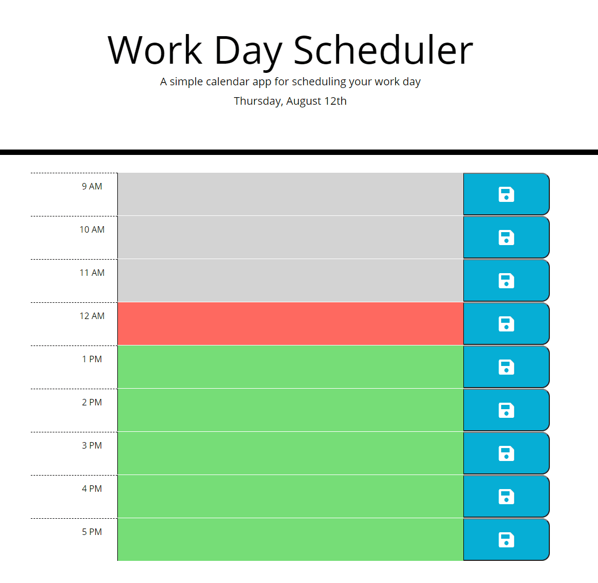

# adrianos-day-planner-5

Homework 5 - Day Planner

## HOMEWORK LINKS

* GitHub Repository [GitHub repository link](https://github.com/AdrianoArmen/adrianos-day-planner-5) 

* Website Deployed [Website Deploy link](https://adrianoarmen.github.io/adrianos-day-planner-5/) 

 ## Mock-Up

The following animation demonstrates the application desired functionality:

## Project Description
This sample Daty Planner was based on existing structural code and designed to showcase my Third-Party APIs knowledge. I used [Moment.js](https://momentjs.com/) library to code the color-based section functionality in which by comparing the current time against the different time-frames available I was able to provide the user with a visual guide to organize his/her work shift. jQuery and Bootstrap were also used to achieve the acceptance criteria and the use of localStorage to save the user input text on the different sections allowed the app to store that data after a browser's refresh and closure.

## App Functionality

The following animation demonstrates the actual application functionality:

